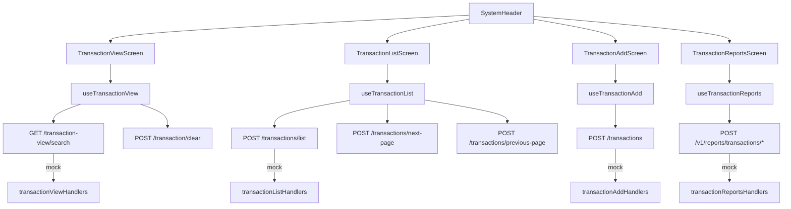

# 💳 TRANSACTIONSCARD - Módulo de Transacciones CARD

**Módulo ID**: `transaction`  
**Versión**: 1.0  
**Última actualización**: 2026-02-15  
**Propósito**: Proveer las pantallas y hooks necesarios para buscar, listar, registrar y reportar transacciones asociadas a cuentas/tarjetas, preservando las reglas heredadas del backend COBOL y enriqueciendo la experiencia con Material-UI, validaciones en el cliente y mock data para QA.

---

## 📋 Descripción general
El módulo combina cuatro pantallas principales: `TransactionViewScreen` para buscar el detalle de una transacción, `TransactionListScreen` para recorrer lotes paginados, `TransactionAddScreen` para registrar movimientos manuales y `TransactionReportsScreen` para generar reportes mensuales, anuales o personalizados. Cada pantalla utiliza tarjetas MUI, `SystemHeader` con identificadores de programa (`CT00`, `CT01`, `CR00`) y hooks (`useTransactionView`, `useTransactionList`, `useTransactionAdd`, `useTransactionReports`) que encapsulan llamadas HTTP, loaders y navegación (`useNavigate`). Los formularios son “full page”, no modales, y respetan las teclas tradicionales (F3=salir, F4=limpiar, F5=recorrer/copy, F7/F8=paginación) heredadas de los menús mainframe.

## 🧑‍💼 Actores y viajes principales
- **Back-office analyst**: Busca transacciones individuales (Enter) o abre el listado paginado para validar bloqueos y saldos con F7/F8. Cancela el flujo con F3 para volver al menú principal.
- **Supervisor de autorización**: Registra transacciones manuales en situaciones de emergencia y valida cada campo (tipo, categoría, comerciante) antes de confirmar con `Y`. Usa la ayuda de `testTransactions` cuando el backend real no está disponible.
- **Equipo de fraude**: Revisa reportes detallados (`TransactionReportsScreen` → `Dialog`) para detectar patrones (cuentas con más de 50 transacciones o importes negativos superiores a 1.000 USD) y descarga el reporte en formato TXT.
- **Integración con UI/UX**: `SystemHeader`, `Alert`, `Chip` y utilidades de formato (`formatCurrency`, `formatDateTime`) garantizan consistencia visual entre transacciones y otros módulos.

## 🏗️ Arquitectura del módulo
### Componentes clave
1. **`TransactionViewScreen.tsx`** (`app/components/transaction/TransactionViewScreen.tsx`) – Formulario centrado que llama a `handleSearch`, muestra `validationErrors`, usa `formatAmount`/`formatDateTime` y ofrece botones para `Clear`, `Browse` y `Exit`. F3 sale, F4 borra, F5 navega a la lista.
2. **`useTransactionView.ts`** – Hook con `useMutation` sobre `/transaction-view/search` y `/transaction/clear`, validación (`Transaction ID cannot be empty...`), navegación a `/transactions/list` y `/menu/main`, y manejo de estado `transactionData`.
3. **`TransactionListScreen.tsx`** – Tabla con encabezados sticky, chips de página y selección por fila. Cada fila tiene input que solo acepta la acción `'S'` para navegar a `/transactions/view/:id`. Teclas F7/F8 controlan la paginación y F3 sale.
4. **`useTransactionList.ts`** – Orquesta `/transactions/list`, `/transactions/next-page`, `/transactions/previous-page`, valida que el ID sea numérico y mantiene `hasNextPage`/`hasPreviousPage`.
5. **`TransactionAddScreen.tsx`** – Formulario con campos obligatorios (ID de cuenta o tarjeta, tipo, categoría, fuente, descripción, montos positivos/negativos, datos del merchant) y pasos de confirmación (`isConfirmationStep`). Incluye tarjetas `Chip`, `Tooltip`, `Button` y ayuda con `testTransactions` para entornos DEV.
6. **`useTransactionAdd.ts`** – Convierte las fechas a ISO (LocalDateTime), convierte monto a BigDecimal, obliga que la confirmación sea `Y` y limpia el formulario luego de un POST exitoso a `/transactions`.
7. **`TransactionReportsScreen.tsx` + `TransactionReportTable.tsx`** – Radio buttons para seleccionar reportes (`monthly`, `yearly`, `custom`), validación de fechas, confirmación (`Y/N`) y tabla con totales por cuenta y gran total. Ofrece descarga de TXT simulando PDF y dialog para mostrar el reporte.
8. **MSW Mock Handlers** – `app/mocks/transactionViewHandlers.ts`, `transactionListHandlers.ts`, `transactionAddHandlers.ts`, `transactionReportsHandlers.ts` reproducen reglas de validación, retrasos (1.2 segundos) y datos sample.

### Flujo de estado
`TransactionViewScreen` ↔ `useTransactionView` ↔ `apiClient.get('/transaction-view/search')` ↔ MSW. `TransactionListScreen` ↔ `useTransactionList` ↔ `/transactions/{list,next-page,previous-page}`. `TransactionAddScreen` ↔ `useTransactionAdd` ↔ `POST /transactions`. `TransactionReportsScreen` ↔ `useTransactionReports` ↔ `/v1/reports/transactions/{monthly,yearly,custom}`. La navegación usa `useNavigate` hacia `/menu/main` y las rutas de detalles/lista.

## 🔗 APIs documentadas
- **GET `/transaction-view/search?transactionId={id}`** – Busca una transacción por ID (requerido, no vacío). Responde `TransactionViewResponse` con `cardNumber`, `transactionTypeCode`, `transactionAmount`, `merchantName`, `errorMessage`, `programName` y `transactionName`.
- **POST `/transaction/clear`** – Resetea la pantalla de consulta y devuelve `TransactionViewResponse` con valores vacíos.
- **POST `/transactions`** – Registra una transacción; recibe `accountId` o `cardNumber` (uno obligatorio), `transactionTypeCode`, `transactionCategoryCode`, `transactionSource`, `transactionDescription`, `transactionAmount`, `originalDate`, `processDate`, `merchantId`, `merchantName`, `merchantCity`, `merchantZip`, `confirmation` (`Y/N`). Retorna `TransactionAddResponse` con `success`, `message` y `transactionId` creado.
- **POST `/transactions/list`** – Lista inicial: `transactionListRequest` con `transactionId?` y `pageNumber`. Responde `TransactionListResponse` con `transactions`, `currentPage`, `hasNextPage`, `hasPreviousPage`, `firstTransactionId`, `lastTransactionId`.
- **POST `/transactions/next-page`** / **`/transactions/previous-page`** – Paginación incremental que regresa los mismos campos y mantiene `currentPage` ajustado.
- **POST `/v1/reports/transactions/{monthly,yearly,custom}`** – Genera reportes; el cuerpo incluye `confirmed: true`, `startDate`/`endDate` (custom). Responde `TransactionReportResponse` con `reportData` (`accountGroups`, `grandTotal`, `totalTransactionCount`).

## 📊 Modelos de datos
```typescript
interface TransactionViewResponse {
  transactionId?: string;
  cardNumber?: string;
  transactionTypeCode?: string;
  transactionCategoryCode?: string;
  transactionSource?: string;
  transactionAmount?: string; // BigDecimal como string
  transactionDescription?: string;
  originalTimestamp?: string;
  processedTimestamp?: string;
  merchantId?: string;
  merchantName?: string;
  merchantCity?: string;
  merchantZip?: string;
  errorMessage?: string;
  currentDate?: string;
  currentTime?: string;
  programName?: string;
  transactionName?: string;
}
```

```typescript
interface TransactionItem {
  transactionId: string;
  date: string; // MM/DD/YY
  description: string;
  amount: number;
}

interface TransactionListResponse {
  transactions: TransactionItem[];
  currentPage: number;
  hasNextPage: boolean;
  hasPreviousPage: boolean;
  firstTransactionId?: string;
  lastTransactionId?: string;
  message?: string;
  errorMessage?: string;
}
```

```typescript
interface TransactionAddRequest {
  accountId?: string;
  cardNumber?: string;
  transactionTypeCode: string;
  transactionCategoryCode: string;
  transactionSource: string;
  transactionDescription: string;
  transactionAmount: string;
  originalDate: string; // ISO
  processDate: string; // ISO
  merchantId: string;
  merchantName: string;
  merchantCity: string;
  merchantZip: string;
  confirmation: 'Y' | 'N' | '';
}

interface TransactionAddResponse {
  transactionId: string | null;
  message: string;
  success: boolean;
}
```

```typescript
interface TransactionReportResponse {
  success: boolean;
  message: string;
  reportType?: string;
  jobId?: string;
  timestamp?: string;
  reportData?: {
    reportType: string;
    startDate: string;
    endDate: string;
    accountGroups: AccountGroup[];
    grandTotal: number;
    totalTransactionCount: number;
    accountCount: number;
  };
}
```

## 📋 Reglas de negocio
1. El `Transaction ID` debe ser numérico y obligatorio al buscar; los campos vacíos arrojan `Transaction ID cannot be empty...` antes de pedir la API.
2. Al registrar, al menos uno entre `accountId` o `cardNumber` debe existir y validar formatos (`accountId` numérico máximo 11 dígitos, `cardNumber` numérico máximo 16 dígitos).
3. Los códigos de tipo (`transactionTypeCode`) y categoría (`transactionCategoryCode`) solo aceptan números (2 y 4 dígitos respectivamente) y no pueden estar vacíos.
4. El `transactionAmount` está acotado a `[-99,999,999.99, 99,999,999.99]` y se convierte a `BigDecimal` en el backend Spring Boot.
5. Merchant ID debe ser numérico; nombre, ciudad y ZIP son obligatorios y se muestran con tarjetas `Chip`/`Tooltip` para asistencia.
6. La confirmación debe ser `Y` (case-insensitive); cualquier otra letra muestra mensaje `Confirm to add this transaction...` o `Invalid value...`.
7. El listado solo permite seleccionar transacciones con la acción `'S'` (select) y muestra error `Invalid selection. Valid value is S` en caso contrario.

## 🎯 Historias de Usuario y complejidad
- **Simple (1-2 pts):** "Como agente de operaciones, quiero buscar un Transaction ID válido para ver el detalle del comercio y el monto formateado en USD." Criterios: validación numérica, Enter dispara la búsqueda, respuesta con `transactionAmount` y `merchantName`, `errorMessage` se muestra en `Alert`.
- **Medio (3-5 pts):** "Como supervisor, quiero registrar una transacción ingresando accountId o cardNumber, tipo/categoría, datos del merchant y confirmar con Y para reflejar el movimiento." Criterios: form completo, validaciones `transactionTypeCode`, `merchantZip`, confirmación, y POST `/transactions` se ejecuta solo tras `isConfirmationStep` true.
- **Complejo (5-8 pts):** "Como analista de fraude, necesito un reporte personalizado (fecha inicio/fin, confirmación) que pueda descargar en TXT y revisar totales por cuenta." Criterios: radiobutton custom, validación de fechas (`startDate <= endDate`), confirmación, se abre dialog con `TransactionReportTable` y el botón `Download TXT` genera el archivo.

## ⚡ Factores de aceleración de desarrollo
- Los hooks (`useTransactionView`, `useTransactionList`, `useTransactionAdd`, `useTransactionReports`) centralizan validaciones, loaders y `apiClient`, por lo que cualquier nueva vista solo necesita importar el hook y mostrar el estado.
- `SystemHeader`, `Alert`, `Chip`, `Stack` y `Button` Material-UI ya están estilizados para las pantallas transaccionales; replicar el layout es cuestión de copiar el patrón de cards y containers.
- MSW (`transactionViewHandlers`, `transactionListHandlers`, `transactionAddHandlers`, `transactionReportsHandlers`) incluye datos de muestra, validaciones y delays (1.2 s) para que QA trabaje sin backend.
- Utilidades como `formatCurrency` y `formatDateTime` viven en `~/utils` y están preparadas para el formato americano (USD, locales en_US).

## 🔧 Fundamento técnico
### Patrones de formularios y listas
- Todas las pantallas son formularios de página completa sin modales (salvo el reporte). Usan componentes `TextField`, `Select`/`RadioGroup`, `Switch` y `Button` de MUI con `Stack` y `Grid` para la estructura.
- Validaciones se ejecutan en los hooks: regex para campos numéricos, chequeo de rangos (`transactionAmount`, `merchantId`) y confirmaciones. Los errores se propagan a la UI vía `validationErrors` y se muestran con `helperText` o `Alert`.
- Listas usan `<Table stickyHeader size="small">` y `Chip` para mostrar la página actual; la selección se gestiona con inputs estilo mainframe y `handleTransactionSelect` que solo acepta `'S'`.

### Patrón de notificaciones y errores
- Se utilizan `Alert` de MUI para mostrar errores de validación tanto en las pantallas de búsqueda/listado/registro como en los reportes.
- `useMutation` de `useApi` agrega `Authorization` y maneja reintentos fallidos; `error` se propaga y se muestra en la sección superior de cada pantalla.
- `TransactionAddScreen` expone `testTransactions` y `handleCopyLastTransaction` (actualmente informa que la copia no está habilitada) para agilizar pruebas.

### Rutas y navegación
- `useNavigate` dirige a `/transactions/list`, `/transactions/view/:id` y `/menu/main`. Las teclas F3 salen, F4 limpian, F5 navegan/copian, F7/F8 controlan páginas; la UI escucha `onKeyDown` en el formulario principal.

## 🌐 Internacionalización
El módulo no tiene i18n; todos los textos están hardcodeados en inglés y español. Migración futura a `react-i18next` o `@formatjs` debe considerar los mensajes de validación existentes (`"Transaction ID cannot be empty..."`, etc.).

## 🧪 Testing y mocking
- MSW expone `transactionViewHandlers`, `transactionListHandlers`, `transactionAddHandlers`, `transactionReportsHandlers` y se importa desde `app/mocks/index.ts`.
- `validate-mocks.sh` contiene reglas que verifican que las transacciones usan números de tarjeta válidos y `cardAccountXref` en los mocks.
- Los handlers simulan delays (1.2 s) y replican la lógica COBOL/Java (confirmación `Y`, validación numérica y mensajes de error). Esto permite montar tests e2e sin backend.

## ⚡ Presupuestos de performance
- Búsqueda de transacción: < 500 ms (P95) en la UI cuando el backend responde correctamente.
- Listado y paginación: < 600 ms para cargar una página con 50 transacciones.
- Registro de transacciones: < 1.200 ms para POST `/transactions` considerando la confirmación y validaciones.
- Descarga de reportes: < 2 s incluyendo renderizado del dialog `TransactionReportTable`.

## 🚨 Riesgos y mitigaciones
1. **Latencia en reportes custom** (agregación de muchos registros) → Mitigación: limitar la ventana a 30 días y descargar en bloques, usar la paginación del handler si es necesario.
2. **Validaciones heredadas** con regex en los hooks → Mitigación: mover validaciones críticas a una librería compartida y reutilizar el mismo schema en tests.
3. **Dependencia de `SystemHeader` para la navegación** → Mitigación: documentar claramente la necesidad de pasar `transactionId/programName` y los accesos a F3-F8.
4. **Sin auditoría de cambios en add/list** → Mitigación: registrar logs en backend (suggested) y enviar `jobId` en el reporte.

## ✅ Lista de tareas
### Completadas
- [x] **TRANSACTIONS-001**: Implementar hooks de búsqueda/listado y validar transacciones numéricas.
- [x] **TRANSACTIONS-002**: Añadir formulario de registro con confirmación `Y` y validaciones de merchant.
- [x] **TRANSACTIONS-003**: Diseñar reportes mensuales/anuales con dialog y descarga TXT.

### Pendientes
- [ ] **TRANSACTIONS-011**: Integrar `useTransactionReports` con backend real (perfiles y jobId).
- [ ] **TRANSACTIONS-012**: Añadir auditoría y log de cambios por transacción.

## 📈 Métricas de éxito
- **Adopción:** 95% del equipo de fraude usa el reporte diario en vez de Excel manual.
- **Engagement:** Tiempo promedio de consulta por transacción < 3 min.
- **Impacto de negocio:** Reducción del 10% en rechazos/movimientos erróneos gracias a validaciones.

## 🔄 Diagrama de arquitectura


## 🧭 Readiness & secuencia recomendada
1. **Prerequisito:** `AUTH` debe proveer JWT; `apiClient` debe inyectar Authorization desde `localStorage`.
2. **Orden:** Primero garantizar los endpoints `/transaction-view/search` y `/transactions/list`, luego `/transactions` (registro) y finalmente `/v1/reports/transactions/*`.
3. **Dependencias:** `Material-UI` para componentes, `react-router-dom` para rutas `/transactions/*`, `MSW` para mocks locales.

## 📚 Material complementario
- `docs/system-overview.md` (catálogo maestro con APIs y reglas generales).  
- `docs/site/modules/transactions/index.html` (guía visual de historias y criterios).  
- `app/mocks/transaction*.ts` (handlers para pruebas locales).  
- `validate-mocks.sh` (script que valida la referencia de card numbers en transacciones).  
- `app/hooks/useTransactionView.ts`, `useTransactionList.ts`, `useTransactionAdd.ts`, `useTransactionReports.ts` (hooks de flujo).

**Precisión del codebase:** > 95%
